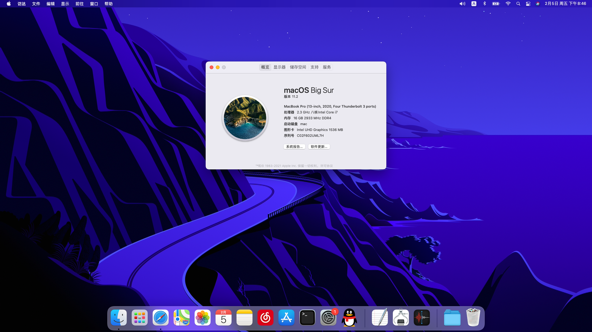

# Master-Pro-X17-Hackintosh
大师之路承影X17接近完美黑苹果, OpenCore Bootloader

#### 该款模具和X3S比较像，理论上相同模具，相似配置的型号都可使用，具体情况请自测。

## macOS Big Sur

## 硬件清单

| 硬件         | 说明                                                         |
| ------------ | -------------- |
| CPU          | 英特尔 Core i7-10875H @ 2.30GHz 八核       |
| 显示屏       | 京东方 BOE0823 17.3 1080P                  |
| **核显**     | **UHD630**                                                   |
| 独显         | Nvidia GeForce RTX 3060 Laptop GPU ( 6 GB )（**已屏蔽**）  |
| 硬盘         | IM2P33F8-512GD ( 512 GB / 固态硬盘 )                |
| **声卡**     | **ALC274**           |
| 有线网卡     | Realtek R8125  PCIe 2.5 GbE          |
| **无线网卡** | **英特尔 Wi-Fi 6 AX201 160MHz**                        |
| 蓝牙         | Intel       |
| 读卡器       | Realtek USB2.0 Card-Reader（可在虚拟机中驱动，推荐Parallels的Win10融合模式） |
| USB接口      | 两个USB3.0+一个USB2.0                                        |
| 摄像头       | 普通集成摄像头                                               |

## 驱动状态

| 文件                  | 说明                                                         |
| :-------------------- | :------------------ |
| 显卡            |   OK，(貌似所有外接显示器接口均在独显上，核显无法输出到HDMI)   |
| 声卡            |   OK   |
| 电池            |   OK   |
| 有线网卡            |   OK   |
| wifi            |   OK   |
| 蓝牙            |   OK   |
| 摄像头            |   OK   |
| 亮度调节            |   OK   |
| 睡眠唤醒            |   OK   |
| 盒盖/开盖            |   OK   |
| 读卡器            |   未驱动，可直通usb在虚拟机中驱动   |

## 更新日志

#### v1.0 --- 2021-02-05

  - 初始版本
  - OpenCore: 2.6.6

## FAQ

1. **nothing**

   nothing

## 帮助

- [Acidanthera](https://github.com/acidanthera)
- [VoodooI2C](https://github.com/voodooi2c)
- [Mieze](https://github.com/Mieze/LucyRTL8125Ethernet)
